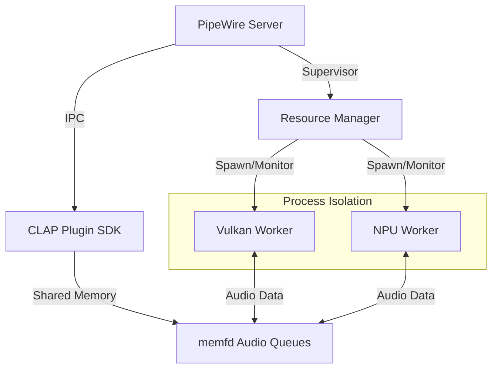

# Linux DSP Acceleration System

> [!WARNING]
> This project is currently in early **Alpha (Work In Progress)**. It is not yet recommended for production environments.

A high-performance, crash-resilient, and heterogeneous audio DSP acceleration system for Linux.

## Documentation

Experience the full project depth through our dedicated guides:
- [**Project Vision**](VISION.md): Our mission to close the professional audio gap.
- [**Installation Guide**](docs/INSTALL.md): Detailed setup for Linux and Windows (WSL).
- [**Architecture Overview**](docs/ARCHITECTURE.md): Deep dive into the Supervisor-Worker model and IPC.
- [**Developer's Guide**](docs/DEVELOPER_GUIDE.md): Technical manual for contributing and adding hardware backends.

## Overview
...

## Architecture

### 1. Supervisor (PipeWire Proxy)
...
...
## Technical Specification

### Worker Control Block
Each hardware process is monitored via a 64-byte aligned structure in Shared Memory:
| Field | Type | Description |
|-------|------|-------------|
| `heartbeat` | `atomic<u64>` | Incremented by Worker every 10ms |
| `last_error`| `atomic<enum>`| `DEVICE_LOST`, `OOM`, etc. |
| `is_ready`  | `atomic<bool>`| True after HW initialization |
| `should_restart`| `atomic<bool>`| Command from Supervisor |

### 2. Independent Workers
Hardware backends are isolated into standalone processes (`dsp-accel-worker`). 
- **Vulkan Worker**: Leverages GPU compute for massively parallel DSP.
- **NPU Worker**: Optimized for tensor-based machine learning/DSP models.
- **DSP Worker**: Specialized for fixed-point/low-power arrays.

### 3. Fault-Tolerant IPC
- **Zero-Latency**: Uses `memfd_create` and `SCM_RIGHTS` (FD passing) to share audio buffers without disk I/O.
- **Stability**: Lock-free SPSC ring buffers ensure real-time safety.
- **Watchdog**: A shared memory heartbeat allows the Supervisor to detect and restart crashed workers instantly.

### 4. Agentic Management (MCP)
An integrated **Model Context Protocol (MCP)** server allows AI agents to monitor hardware health, visualize load, and manage worker processes via standard tool calls.

## Quick Start (Linux/WSL)

### Hardware Requirements
- **Vulkan-capable GPU**: Any modern NVIDIA, AMD, or Intel GPU with Vulkan 1.2+ support.
- **Verification**: Run `vulkaninfo --summary` to ensure your hardware is detected.
- **Other Processors**: Support for NPUs and DSP arrays requires vendor-specific firmware (see `docs/INSTALL.md`).

### Prerequisites
- Linux Kernel 5.x+
- PipeWire dev headers (`libpipewire-0.3-dev`)
- Vulkan SDK
- Node.js (for MCP management)

### Installation & Test
...
...
## Contributing

Contributions are what make the open source community such an amazing place to learn, inspire, and create.
1. Read our [**Developer's Guide**](docs/DEVELOPER_GUIDE.md).
2. Fork the Project.
3. Create your Feature Branch (`git checkout -b feature/AmazingFeature`).
4. Commit your Changes (`git commit -m 'Add some AmazingFeature'`).
5. Push to the Branch (`git push origin feature/AmazingFeature`).
6. Open a Pull Request.

## Licensing
...

This project is licensed under the **GNU General Public License v3.0**. See the [LICENSE](LICENSE) file for details.

## Roadmap
- [ ] Finalize FD-passing handshake.
- [ ] Implement Convolution Reverb Shader.
- [ ] Add real-time GUI/Monitoring dashboard.
